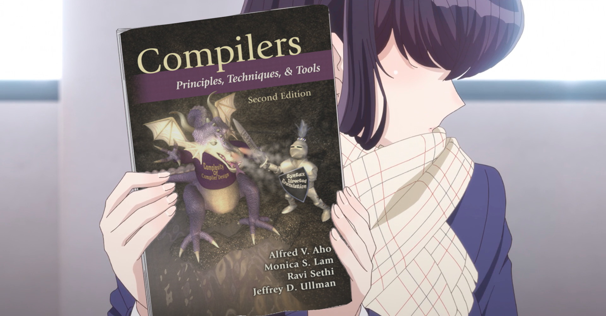
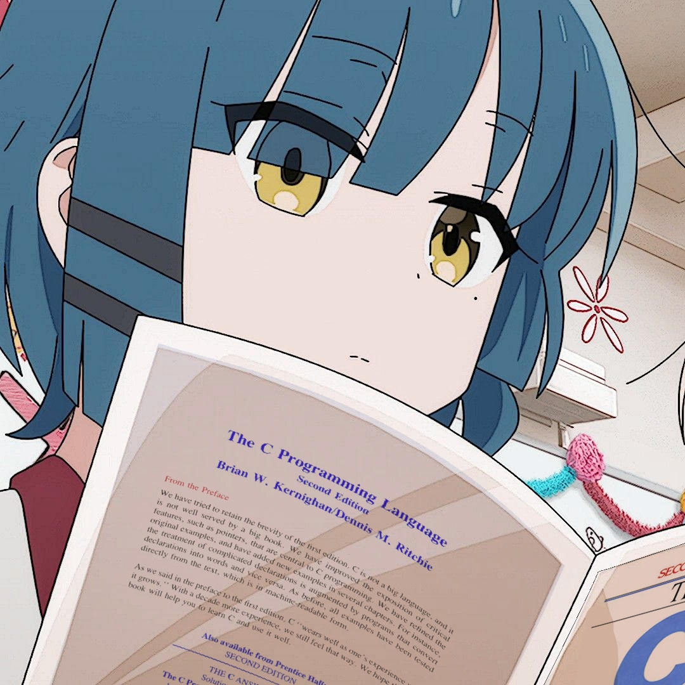

# Backus

| Kategorie               | Technologien                                         |
|-------------------------|------------------------------------------------------|
| **Programmiersprachen** | C, Java, JavaScript, Kotlin, PHP, Python, TypeScript |
| **Markup & Dokumente**  | HTML5, CSS3, Markdown, LaTeX, Typst, Plaintext       |
| **Datenformate**        | JSON, YAML                                           |
| **Datenbanken**         | SQL (SQLite, MariaDB, MySQL)                         |
| **Frameworks & Libs**   | Express.js, Flask, Jinja, Node.js, Vue.js, Vuetify, Jekyll, Liquid   |
| **Entwicklungs-Tools**  | Git, GitHub                                          |
| **Spezialentwicklung**  | 8086-Assembly, GBDK (Game Boy Development Kit)       |
| **Grafik & Design**     | GIMP                                                 |

# Bücher, die hart gehen:

---

|  |          |        |
|------------------------------------------------------------------------------------------------------------------------------------|-----------------------------------------------------------------------------------------------------------------------|----------------------------------------------------------------------------------------------|
|                        |           |                  |
|                                           |  |  |

---
    
